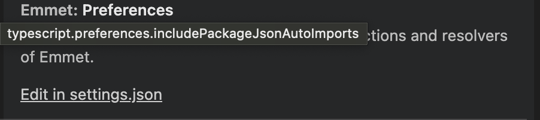
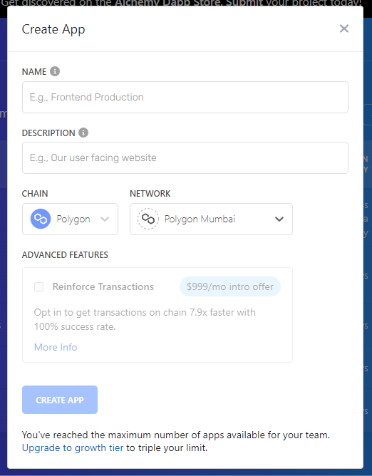
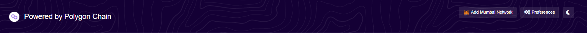

<h1 align="center">
  <br>
  <a href="https://trevz.me"></a>
  <br>
  bearchainAI
  <br>
</h1>

<h4 align="center">Made for <a href="https://codeology.club" target="_blank">Berkeley Codeology</a> Spring 2023 by Trevor Trinh and Anna Chung.</h4>
<p align="center">
  <a href="#%EF%B8%8F-logistics">Logistics</a> •
  <a href="#-tech-setup">Tech Setup</a> •
  <a href="#-repo-setup">Repo Setup</a>
</p>

- **Project Leaders:** Trevor Trinh, Anna Chung
- **Project Blurb:** Tech moves fast, and the fields of blockchain and AI are no exception. Having the ability to operate at the cutting edge is fundamental for both feeding your curiosity and advancing your career in computer science. Our project serves as a gateway of understanding to these technologies, providing hands-on experience with the latest tools and frameworks. We'll be building a web application that utilizes the GPT-3 Davinci artificial intelligence model (fine-tuned with web scraped references) to generate new fanfictions. Motivated by the issue of creator credit in AI-generated media, new fanfiction along with their reference authors will be recorded on the Ethereum blockchain as non-fungible tokens (NFTs).
- **Tech areas:**
  - Blockchain, ML, Web Scraping, Web Dev
- **Tools/technologies involved:**
  - Blockchain: Solidity, Alchemy, Polygon, Hardhat, MetaMask
  - Machine Learning Model: GPT-3 Davinci & Ada
  - Web Scraping: Beautiful Soup, lmxl parser
  - Web dev: Next.js, React, Chakra UI
  - Languages: Python, Solidity, JavaScript (TypeScript)

# Setup Onboarding

‼️ **IMPORTANT** ‼️

Please carefully read the logistics and complete the following tech and repo setup. This is crucial for the smooth operation of your project. If you have any questions or run into any issues, please contact us for assistance!

## 🎛️ Logistics

\~\~\~ [Proj: bearchainAI](https://www.notion.so/Proj-bearchainAI-d10a9792a215458ab8a09e82c7624ed9) \~\~\~

This notion has everything you’ll ever need!

The calendar is the main resource, check it frequently. We will communicate through Facebook Messenger.

[Feedback](https://www.notion.so/Feedback-47674afba64b47ecbeeb56e4108c13b5) is appreciated! 😊

## 💻 Tech Setup

Guide for installing and configuring all required software and accounts

### Programs

<details><summary>a code editor</summary>

- any code editor should work but we recommend Visual Studio Code, which you can download [here](https://code.visualstudio.com/download) !
- Visual Studio Code Python Set Up

  - install the Python extension by Microsoft
  - install a Python interpreter
    - refer to [this link](https://code.visualstudio.com/docs/python/python-tutorial) for detailed instructions plus instructions on setting up a simple python program to test that you’re set up works for python
  - select Python interpreter version
    - do (ctrl+shift+P) or (cmd+shift+P) to open up the command palette
    - type in “Python: Select Interpreter” and make sure it is a version before 3.11
  - make code runner run python3 instead of python in VSC terminal

    - open settings
      - Windows/Linux - File>Preferences>Settings
      - macOS - Code>Preferences>Settings
    - type in preferences: one of the results should have an “edit in settings.json” link, click it

      

    - change your python value in the json to the following so that the terminal uses python3 instead of python when using codeRunner

      ```bash
      "python": "python3 -u"
      ```

</details>

<details><summary>python3</summary>

- check if python is already installed and what version it is by entering this into your terminal:

  ```bash
  python --version
  # or
  python3 --version
  ```

- if not installed \***\*or\*\*** the version is **3.11**, go [here](https://www.python.org/downloads/) and follow download instructions in the ‘looking for specific release’ section to download a previous version (should be python **3.5+** though) - \*make sure to check the box that says **“Add Python To Path”**
</details>

<details><summary>pip3</summary>

- check if pip3 is installed by entering this into your terminal:

  ```bash
  pip --version
  # or
  pip3 -v
  ```

- if **pip command not found** check out [this article](https://definir-tech.com/app2/19847/how-do-i-fix-pip-command-not-found#:~:text=The%20pip%3A%20command%20not%20found,and%20pip3%20onto%20your%20system.) for trouble shooting (for both windows and mac (home brew))
- to upgrade pip enter this in your terminal:

  ```bash
  python3 -m pip3 install --upgrade pip
  #or
  python -m pip3 install --upgrade pip
  ```

</details>

<details><summary>node.js</summary>

- check if node.js is already installed

  - enter the following into your terminal to check for node as well as npm:

    ```bash
    node -v
    npm -v
    ```

  - if a version is return than node.js and npm are already installed, move onto updating package manager

- if not installed

  - normal install
    - download node.js [here](https://nodejs.org/en/download/), download LTS version
    - run the installer, keep default settings, press install
  - home brew install

    - run the following in your terminal:

      ```bash
      brew install node
      ```

  - after installation check if node.js and npm is installed by running the following in the terminal again:

    ```bash
    node -v
    npm -v
    ```

  - if version numbers come out you’re good to go

- update node package manager (npm)

  - windows

    - run the following command in the terminal:

      ```bash
      npm install npm --global
      ```

  - macOS

    - run the following command in your terminal

      ```bash
      sudo npm install npm --global
      ```

  </details>

<details><summary>yarn</summary>

- check if you already have yarn installed by running the following in the terminal:

  ```bash
  yarn --version
  ```

  - if it returns a version you’re good to go else go to the next drop down

- install yarn

  - run the following in the terminal:

    ```bash
    npm install --global yarn
    # then run this to check that it installed
    # properly and returns a version
    yarn --version
    ```

  - if that doesn’t work refer to [this link](https://classic.yarnpkg.com/lang/en/docs/install/#mac-stable) and enter in your OS specifics in the ‘alternatives’ drop down and follow those instructions

  </details>

### Accounts

<details><summary>gpt-3</summary>

- [make an open ai account](https://openai.com/api/)

  - (or more than one honestly, you might need it — borrow some phone numbers & emails from friends or family members?)
  - we will be using these API keys later

  </details>

<details><summary>metamask</summary>

- [install metamask chrome extension](https://metamask.io/download/)

  - setup your wallet
  - we will be using the private key later

  </details>

<details><summary>alchemy</summary>

- [make an alchemy account](https://auth.alchemy.com/signup)

  - create a new app on the dashboard with any name and description
  - ensure to set the chain and network to polygon/mumbai
  - we will be using the API keys later

  

- [get some matic](https://mumbaifaucet.com/)

  - use the alchemy faucet to receive some test matic

    </details>

<details><summary>polygonscan</summary>

- [make a polygon scan account](https://polygonscan.com/register)
- [generate a new API key](https://polygonscan.com/myapikey)
  - we will be using this API key later
- add polygon mumbai network to metamask

  - scroll to the bottom of [mumbai.polyscan](https://mumbai.polygonscan.com/) and click “Add Mumbai Network”

  

    </details>

## 😸 Repo Setup

Guide for cloning repo, installing dependencies, and setting environment variables for local development and deployment on Replit.

<details><summary>cloning and repo setup</summary>

- create a new repo on github (make the name zesty)
- clone our skeleton code to your local machine

  ```bash
  git clone <PROJECT URL HERE>
  ```

- set the remote origin to be YOUR newly created repo
  - this is so you can make commits to your own repo on github
  ```bash
  git remote set-url origin <your newly made github repo url>
  ```
- set the remote start origin to be OUR skeleton code repo
  - this is so you can get updates to our starter code
  ```bash
  git remote add starter <PROJECT URL HERE>
  ```
  - after doing so, you can get the latest starter code with the following command
    ```bash
    git pull starter main
    ```
- once you’ve completed the above, send Trevor the link to your repo via messenger
  </details>

<details><summary>installing dependencies</summary>

- python dependencies

  - in root of project, create a virtual env and install packages from requirements.txt

    ```bash
    python3 -m venv venv
    pip install -r requirements.txt
    ```

- nodejs dependencies

  - in _both_ web/ and blockchain/ install packages from package.json

    - if not use something like `nvm` to install a compatible node version

    ```bash
    # in web/ and blockchain/
    yarn install
    ```

  </details>

<details><summary>env variables</summary>

- create a .env.local file in web/

  ```bash
  ALCHEMY_API_KEY=
  ALCHEMY_API_URL=
  ALCHEMY_API_WEBSOCKETS=
  CONTRACT_ADDRESS=
  OPENAI_API_KEY=
  ```

- create a .env file in blockchain/

  ```bash
  ALCHEMY_API_URL=
  POLYGONSCAN_API_KEY=
  PRIVATE_KEY=
  ```

  </details>

<details><summary>local dev workflow</summary>

- for the web interface, run `yarn dev` to view project at localhost:3000
- do devvy work, make commits, and push to github

  </details>

<details><summary>replit deployment</summary>

- make a replit account
- import github repo
- update secrets json

  ```json
  {
    "ALCHEMY_API_KEY": "",
    "ALCHEMY_API_URL": "",
    "ALCHEMY_API_WEBSOCKETS": "",
    "CONTRACT_ADDRESS": "",
    "OPENAI_API_KEY": ""
  }
  ```

- can pull latest repo changes in the command line to share your updates
  </details>
